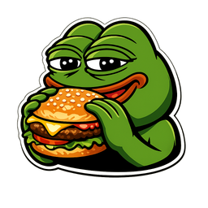

# 🍔 ZingerBurger AI Webtoon Studio

  

**ZingerBurger** is a Chrome extension that turns written chapters into text-free webtoon panels. It uses Gemini for storyboarding and Google Flow (Nano Banana) for image generation, with a focus on consistent characters, clean compositions, and vertical webtoon formats.

Developed by **[FauxGUY](https://github.com/FauxGUY)**.

## Features

* **📖 Automated Storyboarding** — Breaks chapters into key scenes and generates a structured storyboard, targeting 15–20 panels per chapter.
* **🎨 Webtoon-Ready Artwork** — Generates clean, text-free panels designed for vertical webtoon layouts.
* **📏 Multiple Aspect Ratios** — Supports 9:16, 3:4, 1:1, 4:3, and 16:9.
* **⚡ Batch Processing** — Process multiple `.txt` chapters sequentially or in parallel.
* **📦 Automatic Export** — Combines generated panels into vertical strips and exports both `.zip` and `.pdf` files.
* **🖥️ Generation Dashboard** — Track active jobs, queues, and generation progress from a single interface.

## 📥 Download

[**⬇️ Download the latest release**]([https://github.com/FauxGUY/ZingerBurger/releases/latest](https://github.com/FauxGUY/zingerBurger-novel-to-visuals-maker-using-flow-/releases/tag/v1.0.0))
## 🚀 Installation & Usage

1. Download the latest `.zip` release and extract it to a folder.
2. Open Chrome and go to `chrome://extensions/`.
3. Enable **Developer mode**.
4. Click **Load unpacked** and select the extracted ZingerBurger folder.
5. Open [Gemini](https://gemini.google.com/) and [Google Flow](https://flow.google/), and make sure you are signed in.
6. Open ZingerBurger from the Chrome toolbar.
7. Paste your chapter text and click **Generate**.

## ⚙️ How It Works

ZingerBurger uses a two-stage generation pipeline:

### 1. Storyboard — Gemini

Gemini processes the chapter and identifies important scenes, characters, actions, and visual details. It then converts the chapter into a structured storyboard based on the project's character and visual references.

### 2. Artwork — Google Flow

The storyboard is passed to Google Flow, which generates the individual panels. Image references are used where needed to help maintain character appearance, clothing, and visual consistency between scenes.

## 📄 License & Credits

Created by **[FauxGUY](https://github.com/FauxGUY)**.

